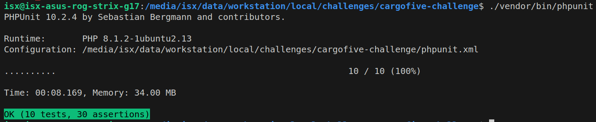

# CARGOFIVE CHALLENGE

## Context
The proposed problem indicates that there are names of non-standardized concepts.
That having several names that refer to oneself makes it difficult to want to segment it in an orderly and easy-to-maintain manner for integration with other services and the saving of the rates through an excel file with its respective surcharge configuration (surcharge concept - apply to)

## Solution
Standardize the concepts and that they have aliases so that when saving the rates excel it is verified that the alias is associated with the concept and that it is configured with the type of application.

Example to standarize concept with aliases.

**Database diagram**

**Description by table**
- Table **surcharge_concepts** stores all standardized concepts.
- Table **surcharge_concept_aliases** stores the concept's aliases.
- Table **surcharge** stores the configuration of concept and apply to(freight. origin, destination).
- Table **rates** stores surcharge, amount, currency and carrier.
- Table **carriers** stores carriers.

## Stack
- **Programming language:** PHP V8.1
- **Framework:** Lumen - PHP Micro-Framework By Laravel
- **Database:** MySQL

## Requeriments
- [PHP 8.1](https://www.php.net/releases/8.1/en.php).
- [Composer](https://getcomposer.org).
- [MySQL](https://www.mysql.com)
- [Docker](https://www.docker.com) *(optional)*
- [Docker Compose](https://www.docker.com) *(optional)*
- We must create two databases, one to normal use and the other for tests. Examples: cargofive, cargofice_test

## Installations y execution

- Install libraries for PHP 8.1 if you use Linux Ubuntu:
    > sudo apt install php8.1-cli \\\
    >   php8.1-mbstring \\\
    >   php8.1-xml \\\
    >   php8.1-curl \\\
    >   php8.1-mysql \\\
    >   php8.1-gd \\\
    >   php8.1-zip

- Clone repositoy

- Install dependencies with composer: 
    > composer install

- Copy **.env.example** file to create **.env** file and edit database connection variables of normal use.
    * DB_HOST: Host or ip.
    * DB_PORT: Connection port.
    * DB_DATABASE: Database's name.
    * DB_USERNAME: User to connect with database.
    * DB_PASSWORD: User's password to connect with database.

- Run seeder for restore database:
    > php artisan db:seed

- Start application:
    > php -S localhost:8000 -t public

## Execute Unit Tests
- Edit file  **phpunit.xml**  to change test database connection if it is necessary.
    * DB_HOST: Host or ip.
    * DB_PORT: Connection port.
    * DB_DATABASE: Test database name.
    * DB_USERNAME: User to connect with test database.
    * DB_PASSWORD: User's password to connect with test database.

- Execute:
    > ./vendor/bin/phpunit

## ENDPOINTS
For test the endpoints you must use this credentials:
- **user:** israel.flores@cargofive.com
- **password:** cargofive123.

### Authenticate
Allow to get bearer token for use other endpoints

> curl --location 'http://localhost:8000/authenticate' \\\
> --form 'email="israel.flores@cargofive.com"' \\\
> --form 'password="cargofive123."'

### Load rates
Allow to save rate from excel file. You must need bearer token to use it.

> curl --location 'http://localhost:8000/rates' \\\
> --header 'Authorization: Bearer eyXXXXXA' \\\
> --form 'file=@"/path-file/file-rates.xlsx"'

### Get rates
Allow to get rates. You must need bearer token to use it.
For better search you can use the next params with the combinations that you prefer:
- **surcharge_concept_id:** concept standarized id
- **carrier_id:** carrier id
- **apply_to:** It must be freight. origin or destination

#### Get all rates
> curl --location 'http://localhost:8000/rates' \\\
> --header 'Authorization: Bearer eyXXXXXAA'

#### Get all rates of specific concept
> curl --location 'http://localhost:8000/rates?surcharge_concept_id=3' \\\
> --header 'Authorization: Bearer eyXXXXXAA'

#### Get all rates of specific concept and carrier
> curl --location 'http://localhost:8000/rates?surcharge_concept_id=3&carrier_id=2' \\\
> --header 'Authorization: Bearer eyXXXXXAA'

#### Get all rates of specific concept, carrier and apply to
> curl --location 'http://localhost:8000/rates?surcharge_concept_id=12&carrier_id=2&apply_to=origin' \\\
> --header 'Authorization: Bearer eyXXXXXAA'

#### Get all rates of specific carrier and apply to
> curl --location 'http://localhost:8000/rates?carrier_id=2&apply_to=destination' \\\
> --header 'Authorization: Bearer eyXXXXXAA'

